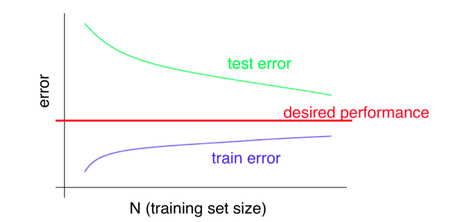

# Temas a trabajar

1. Variance and Bias Tradeoff (*Dilema de la varainza y el sesgo*)
    i) Cross Validation
          a. Train and Test Split
          b. Leave One Out Cross Validation (LOOCV)
          c. K-Folds Cross Validation (K-Folds)
    ii) Error and Bias Curve
    iii) Learning Curves (*Curvas de aprendizaje*)
3. Visualizacion con la libreria Caret
    i) Regresion
    ii) Clasificacion
        a. Pairs
        b. Density
        c. Boxplot
4. Preprocesado con Caret
    i. Dummy Variables (Variables Artificiales)
    ii. Zero or Near Zero Variance (NZV)
    iii. Correlated Predictors (Autocorrelacion)
    iv. Centrado y Escalado
5. Clasificacion (KNN)
    i. Intro a KNN
    ii. Ejemplo 1 KNN - Dataset Iris
    iii. Ejemplo 2 KNN - Dataseet Loan

# Variance and Bias Tradeoff

**Bias (Under Fit)**

* Train Error High
* Validation Error High

**Variance (Over Fit)**

* Train Error Low
* Validation error High

## Cross Validation

Es un metodo de **Re-Muestreado** en el que un determinado numero de observaciones se deja fuera del proceso de entrenamiento para luego ser usado como validacion de como se generaliza el muestreo. Es decir con este metodo podemos obtener el error de validación.

### Train-Test Validation

**Validation error**
$$MSE = \sum_{i=1}^N(Y_i - \hat y_i)^2$$
donde,

* $Y_i$ es el valor verdadero para la fila $i$ del test dataset.
* $\hat y_i$ es el valor predecido por el algoritmo para la observacion $i$ del test set.
* N es el total de observaciones en el test set.

### Leave One Out Cross Validation (LOOCV)

**Validation error**

$$J_{cv}=\frac{1}{n}\sum_{i=1}^n MSE_i$$

* $n$ Numero total de observaciones
* $MSE_i$ suma de los errores al cuadrado del $i$-esimo LOOCV 

### K-folds Cross Validation

**Validation error**

$$J_{cv}=\frac{1}{k}\sum_{i=1}^k MSE_i$$

* $k$ Numero total de folds
* $MSE_i$ suma de los errores al cuadrado del $i$-esimo k-fold

## Learning Curves

